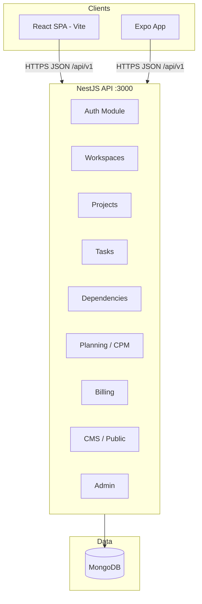
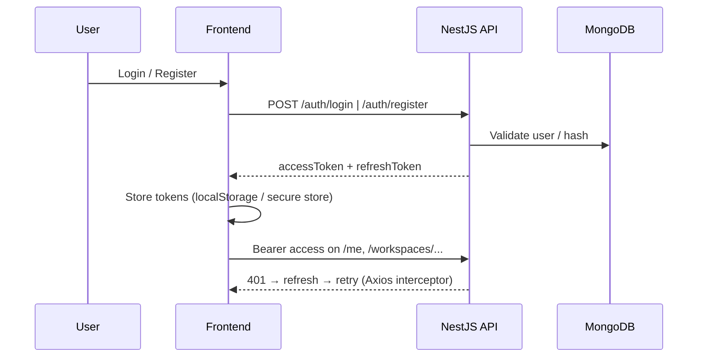

<div align="center">

# PlanForge

**Multi-tenant SaaS Project Management Platform**

Gantt, WBS, Critical Path Method (CPM), billing, RBAC, and CMS-driven marketing — in one codebase.

[](https://nodejs.org/)
[](https://nestjs.com/)
[](https://react.dev/)
[](https://expo.dev/)
[](https://mongoosejs.com/)
[](#license)

[Features](#features) · [Architecture](#system-architecture) · [Installation](#installation) · [API](#api-documentation) · [Contributing](#contributing)

</div>

<!-- placeholder: replace with your production / marketing screenshot -->
<details>
<summary><strong>Screenshots</strong> (placeholders)</summary>

| Landing & marketing | Workspace / project |
|---------------------|---------------------|
| _Add `./docs/screenshots/landing.png`_ | _Add `./docs/screenshots/project.png`_ |

_Community tip: export PNGs (~1600×900), store under `docs/screenshots/`, and update the markdown image paths._

</details>

---

## Table of contents

1. [Project overview](#project-overview)
2. [Features](#features)
3. [Screenshots](#screenshots)
4. [Technology stack](#technology-stack)
5. [System architecture](#system-architecture)
6. [Monorepo structure](#monorepo-structure)
7. [Installation](#installation)
8. [Environment variables](#environment-variables)
9. [Authentication](#authentication)
10. [RBAC & tenancy](#rbac--tenancy)
11. [Billing](#billing-system)
12. [CMS & dynamic pages](#cms--dynamic-pages)
13. [Internationalization (i18n)](#internationalization-i18n)
14. [API documentation](#api-documentation)
15. [Database models](#database-models)
16. [Realtime & freshness](#realtime--freshness)
17. [Security](#security)
18. [Deployment](#deployment)
19. [Performance](#performance-notes)
20. [Roadmap](#roadmap)
21. [Contributing](#contributing)
22. [License](#license)

---

## Project overview

### What is PlanForge?

**PlanForge** is a modern, multi-tenant project management SaaS oriented toward teams that plan in **time and dependency-aware** workflows — not only task lists.

It combines classic PM discipline (**Gantt**, **WBS**, **CPM**, **dependency scheduling**) with **workspace isolation**, **RBAC**, **subscriptions & billing**, and a **CMS-style** surface for landing pages and public content.

### What problem does it solve?

Discrete tools for Gantt, resource planning, and billing fragments delivery context. PlanForge aligns **portfolio structure**, **critical path**, and **commercial plans** behind a unified API and product UI so operators and PMs stay in one system.

### Who is it for?

| Audience | Benefit |
|---------|---------|
| **Delivery / PMO teams** | Dependency-aware scheduling, WBS, CPM |
| **Product / SaaS operators** | Platform admin, billing, CMS for marketing |
| **Developers** | NestJS + React monorepo, Swagger, typed DTOs |
| **Mobile users** | Expo companion app (workspaces, projects, tasks) |

---

## Features

| Area | Details |
|------|---------|
| **Multi-tenant architecture** | Data scoped by workspace; members per workspace |
| **RBAC** | Platform role + per-workspace roles with capability checks |
| **Workspace isolation** | APIs route through `workspaces/:workspaceId/...` patterns |
| **Gantt** | Timeline visualization (`gantt-task-react` in web app) |
| **CPM / planning** | Backend planning module + project-level planning endpoints |
| **WBS** | Hierarchical work breakdown in UI |
| **Task dependencies** | Dedicated dependencies module & APIs |
| **Resource planning** | Resource allocation schemas and UI panels |
| **Billing** | Subscription plans, invoices, payments, refunds, enterprise contracts (admin) |
| **Public pricing** | Active plans drive landing pricing via public API |
| **CMS** | Site pages, footer/nav, media uploads; TipTap rich editor in admin |
| **Analytics** | Project analytics endpoints and dashboard views |
| **i18n** | **Turkish (TR)** and **English (EN)** only — no other locales in product config |
| **Theming** | Tailwind `dark` utilities; dedicated light/dark toggle in **Billing module** UI |
| **Notifications** | In-app notification affordances in shell (bell); extend as needed |
| **Auth** | JWT access + refresh, Google OAuth (optional), protected routes in SPA |
| **Audit / activity** | Admin activity and operational views |
| **File uploads** | CMS site media; multer-backed uploads in admin |
| **Comments & collaboration** | Task drawer and project surfaces (extend for full comment threads) |

---

## Screenshots

> **Tip:** Create `docs/screenshots/` and link images here for a polished GitHub README.

```text
docs/
  screenshots/
    01-landing.png
    02-dashboard.png
    03-gantt.png
    04-billing-admin.png
```

Example markdown (uncomment when assets exist):

```markdown
<p align="center">
  
  
</p>
```

---

## Technology stack

| Layer | Technologies |
|-------|----------------|
| **Backend** | **Node.js**, **NestJS 10**, **MongoDB** (Mongoose), **JWT** (Passport), **Google OAuth**, **Swagger**, **Helmet**, **@nestjs/throttler**, Argon2, class-validator |
| **Frontend** | **React 18**, **TypeScript**, **Vite 5**, **Tailwind CSS**, **React Router 6**, **TanStack React Query**, **Axios**, **TipTap**, **React Hook Form**, **Zod** |
| **Mobile** | **Expo / React Native** (Expo Router), React Query, Secure Store |
| **Shared** | Root workspace package `planforge-pm` (`file:..` from apps) |

> **Note:** There is **no Socket.io server** in this repository today. Updates are primarily **HTTP + React Query**; a WebSocket gateway can be added with NestJS `@nestjs/websockets` if you need live presence (see [Realtime](#realtime--freshness)).

---

## System architecture

### High-level



### Auth flow (simplified)



### Frontend composition

- **Marketing:** landing, public pages (`/:slug`), CMS-driven nav/footer.
- **App shell:** `/dashboard` routes under `Protected` layout; role-specific dashboard views.
- **Admin / billing:** platform-admin-only routes; billing module with **light/dark** toggle persisted in `localStorage`.

---

## Monorepo structure

```text
planforge-pm/                 # Workspace root (npm scripts orchestrate packages)
├── package.json             # Root scripts: install:all, dev:*, build, seed
├── planforge-pm/             # Shared package consumed by backend/frontend/expo (workspace path)
├── backend/                 # @planforge/backend — NestJS API
│   ├── src/
│   │   ├── auth/           # JWT, refresh tokens, Google OAuth
│   │   ├── users/          # GET /me
│   │   ├── workspaces/     # Tenancy CRUD & membership
│   │   ├── projects/       # Projects under workspaces
│   │   ├── tasks/          # Tasks per project
│   │   ├── dependencies/   # Task dependency graph
│   │   ├── resources/      # Allocations etc.
│   │   ├── planning/       # Scheduling / CPM-related APIs
│   │   ├── analytics/      # Project analytics
│   │   ├── billing/       # Plans, invoices, ledger (admin + public pricing)
│   │   ├── cms/            # Site pages, footer, public controllers
│   │   ├── admin/          # Platform admin aggregator
│   │   ├── me-dashboard/   # Personalized dashboard payloads
│   │   ├── common/        # Guards, decorators, filters, pipes
│   │   ├── config/         # Env validation (Zod)
│   │   └── main.ts         # Swagger at /api/docs
│   └── nest-cli.json
├── frontend/                # @planforge/frontend — Vite + React
│   ├── src/
│   │   ├── App.tsx         # Routes, guards, legacy redirects
│   │   ├── layouts/        # AppLayout (authenticated shell)
│   │   ├── pages/          # Landing, auth, dashboard, billing, admin
│   │   ├── features/       # Domain hooks (auth, projects, tasks, billing, cms)
│   │   ├── components/     # UI, marketing, admin CMS editors
│   │   ├── i18n/           # I18nProvider, locales (en.json, tr.json only)
│   │   └── lib/            # api-client (Axios + token refresh)
│   └── vite.config.ts
└── expo-app/                # @planforge/expo-app — Expo Router
    └── app/
        ├── (auth)/         # login, register
        └── (app)/          # workspaces, projects, tasks
```

---

## Installation

### Prerequisites

- **Node.js** ≥ 20 (recommended)
- **npm** (or pnpm/yarn with equivalent workspace commands)
- **MongoDB** — local instance or **MongoDB Atlas** URI

### 1. Clone

```bash
git clone https://github.com/your-org/planforge-pm.git
cd planforge-pm
```

### 2. Install dependencies

```bash
npm run install:all
# or manually:
# npm install --prefix backend && npm install --prefix frontend && npm install --prefix expo-app
```

### 3. Environment

Copy and edit env files (see [Environment variables](#environment-variables)). The backend **validates** configuration at boot via Zod.

### 4. Seed (optional)

```bash
npm run seed
```

### 5. Run backend

```bash
npm run dev:backend
# → http://localhost:3000/api/v1
# → Swagger: http://localhost:3000/api/docs
```

### 6. Run frontend

```bash
npm run dev:frontend
# default Vite: http://localhost:5173
```

Set `VITE_API_BASE_URL` to your API base (e.g. `http://localhost:3000/api/v1`).

### 7. Run Expo

```bash
cd expo-app
npx expo start
```

Point the mobile app at the same API base via your Expo env / constants pattern.

---

## Environment variables

### Backend (`backend/.env`)

Validated in `backend/src/config/configuration.ts`.

| Variable | Required | Description |
|----------|----------|-------------|
| `NODE_ENV` | optional | `development` \| `test` \| `staging` \| `production` (default: `development`) |
| `PORT` | optional | HTTP port (default: `3000`) |
| `MONGODB_URI` | **yes** | MongoDB connection string (Atlas or local) |
| `JWT_ACCESS_SECRET` | **yes** | Secret for signing access tokens (min 16 chars) |
| `JWT_REFRESH_SECRET` | **yes** | Secret for refresh token handling (min 16 chars) |
| `JWT_ACCESS_EXPIRES_IN` | optional | Access TTL seconds (default: `900`) |
| `JWT_REFRESH_EXPIRES_IN` | optional | Refresh TTL seconds (default: `2592000`) |
| `GOOGLE_CLIENT_ID` | optional | Enables Google OAuth when paired with secret |
| `GOOGLE_CLIENT_SECRET` | optional | Google OAuth client secret |
| `GOOGLE_CALLBACK_URL` | optional | OAuth callback (default Nest callback path) |
| `CORS_ORIGIN` | optional | Comma-separated origins in production |
| `PLATFORM_DISPLAY_NAME` | optional | Platform label in admin / emails |
| `SUPPORT_EMAIL` | optional | Support contact |
| `OPEN_REGISTRATION` | optional | Disable public register when `false` |
| `MAINTENANCE_MODE` | optional | Blocks register when `true` |
| `DEFAULT_NEW_WORKSPACE_PLAN` | optional | `free` \| `pro` \| `enterprise` |
| `BILLING_PRO_SEAT_USD_MONTHLY` | optional | Modeling default for Pro MRR |
| `API_PUBLIC_BASE_URL` | optional | Public API URL for links |
| `APP_VERSION` | optional | Release label |

**Example (development skeleton):**

```env
NODE_ENV=development
PORT=3000
MONGODB_URI=mongodb://127.0.0.1:27017/planforge
JWT_ACCESS_SECRET=change-me-min-16-chars!!
JWT_REFRESH_SECRET=change-me-min-16-chars!!
CORS_ORIGIN=http://localhost:5173
```

### Frontend (`frontend/.env` / `.env.local`)

| Variable | Description |
|----------|-------------|
| `VITE_API_BASE_URL` | API base URL including `/api/v1` prefix (see `frontend/src/lib/api-client.ts`) |

```env
VITE_API_BASE_URL=http://localhost:3000/api/v1
```

### Expo

Configure API base URL via Expo `app.config` / `expo-constants` as you standardize for staging/production.

---

## Authentication

| Mechanism | Details |
|-----------|---------|
| **JWT access** | Short-lived bearer token attached by Axios interceptor |
| **JWT refresh** | Rotates on `401` via `POST /auth/refresh` |
| **Google OAuth** | Optional — backend redirects to SPA `/auth/callback#access=…&refresh=…` |
| **Logout** | `POST /auth/logout`; clears refresh family server-side pattern via service |
| **Protected routes** | Nest **global JwtAuthGuard** with `@Public()` for open routes; React `Protected` layout for `/dashboard` tree |
| **Session rehydrate** | Web: `tokens.load()` + `GET /me` on app boot in `AuthProvider` |

Frontend token storage keys (see `frontend/src/lib/api-client.ts`): `planforge.access`, `planforge.refresh`.

Marketing shell respects authenticated users (`/dashboard` CTAs and logo destination) via shared auth context.

---

## RBAC & tenancy

### Platform role (`User.platformRole`)

| Role | Scope |
|------|--------|
| `platform_admin` | Cross-tenant admin: billing module, users, CMS, activity, settings |
| `user` | Standard SaaS user |

### Workspace membership (`WorkspaceMember.role`)

| Role | Typical use |
|------|-------------|
| `owner` | Full control, billing ownership context |
| `admin` | Manage members & project settings |
| `member` | Contribute to projects and tasks |
| `viewer` | Read-mostly access |
| `client` | External / limited stakeholder access |

> **Guest:** interpret as **invited** members with `status: invited` or future guest accounts — not a separate enum value in the current schema.

### Enforcement

- Controllers scope operations by `workspaceId` and resolve the caller’s membership.
- Admin routes use platform-admin checks in the frontend (`PlatformAdminOnly`) and corresponding backend guards on `/admin/*` handlers.

---

## Billing system

- **Subscription plans** stored as Mongo documents; **active** plans surface on the **public** pricing API consumed by the landing page.
- **Workspace** records carry plan / trial / subscription-relevant fields (see `workspace` schema and billing service).
- **Admin billing** UI: overview, subscriptions, plans, invoices, payments, refunds, enterprise, analytics, settings.
- **Dynamic pricing table** on marketing site reads live catalog data (no duplicate static price tables in code).

---

## CMS & dynamic pages

| Capability | Implementation |
|------------|------------------|
| **Site pages** | Mongo `SitePage` — slug, title, body, nav visibility |
| **Footer & top nav** | `SiteFooterConfig` — columns, links, tagline, CTA |
| **Public API** | `GET /api/v1/public/site-pages`, `site-nav`, `site-footer`, `site-pages/:slug` |
| **Admin API** | Under `/api/v1/admin/...` (pages CRUD, footer replace, media upload) |
| **Rich text** | TipTap-based `SitePageRichEditor` in admin UI |
| **Media** | Uploaded files served from `GET /api/v1/public/site-media/:filename` with safe path checks |

---

## Internationalization (i18n)

- **Supported UI languages:** **English (`en`)** and **Turkish (`tr`)** only. No Spanish, Italian, or other locales in the product configuration.
- **Translation files:** `frontend/src/i18n/locales/en.json` and `tr.json`.
- **Runtime:** `I18nProvider` + `useT()` / `useI18n()`; locale persisted in `localStorage` (`locale` key).
- **CMS copy:** `pickLocalized()` supports optional `{ tr, en }` fields on API strings; marketing defaults map known English seed strings to i18n keys for footer/nav.

---

## API documentation

Interactive **Swagger UI** is served at:

```text
http://localhost:3000/api/docs
```

Global prefix: **`/api/v1`**.

### Representative endpoints

| Area | Method & path | Notes |
|------|----------------|-------|
| **Auth** | `POST /auth/register`, `POST /auth/login`, `POST /auth/refresh`, `POST /auth/logout` | Logout requires bearer |
| **Auth** | `GET /auth/google`, `GET /auth/google/callback` | Optional OAuth |
| **User** | `GET /me` | Current profile |
| **Dashboard** | `GET /me/dashboard` | Personalized shell data |
| **Workspaces** | `GET/POST /workspaces`, `GET/PATCH /workspaces/:id`, … | Tenancy |
| **Projects** | Under `/workspaces/:workspaceId/projects` | Portfolio |
| **Tasks** | `.../projects/:projectId/tasks` | Task CRUD |
| **Dependencies** | `.../projects/:projectId/dependencies` | Graph edges |
| **Planning** | `.../projects/:projectId/planning` | Schedule / CPM oriented |
| **Analytics** | `.../projects/:projectId/analytics` | Metrics |
| **Billing (admin)** | `/admin/billing/...` | Operators |
| **Public** | `/public/pricing-plans`, `/public/site-footer`, … | Marketing |

### Example: login

**Request**

```http
POST /api/v1/auth/login HTTP/1.1
Content-Type: application/json

{
  "email": "you@company.com",
  "password": "••••••••"
}
```

**Response**

```json
{
  "accessToken": "<jwt>",
  "refreshToken": "<jwt>"
}
```

### Example: current user

```http
GET /api/v1/me HTTP/1.1
Authorization: Bearer <accessToken>
```

```json
{
  "id": "...",
  "email": "you@company.com",
  "displayName": "Ada Lovelace",
  "platformRole": "user",
  "timezone": "UTC"
}
```

---

## Database models

Important Mongoose schemas (see `backend/src/**/schemas`):

| Model | Purpose |
|-------|---------|
| `User` | Accounts, `platformRole`, OAuth ids |
| `Workspace` | Tenant container, plan metadata |
| `WorkspaceMember` | User ↔ workspace role & status |
| `Project` | Project entity under workspace |
| `Task` | Work units, schedule fields |
| `TaskDependency` | Predecessor / successor edges |
| `ResourceAllocation` | Resource planning rows |
| `PlanningSnapshot` | Persisted planning outputs |
| `SubscriptionPlan` | Sellable plans & feature flags |
| `Invoice`, `Payment`, `Refund`, `SeatEvent`, `PlanChangeLog`, `EnterpriseContract` | Billing ledger |
| `SitePage`, `SiteFooterConfig` | CMS |
| `RefreshToken` | Session / refresh storage |

---

## Realtime & freshness

| Today | Direction |
|-------|-----------|
| **HTTP + polling-friendly React Query** | Default data freshness for dashboards and detail views |
| **No Socket.io server in-repo** | Add Nest WebSocket gateway for notifications, live task updates, presence |
| **Optimistic UX** | Local state + query invalidation after mutations |

---

## Security

| Control | Implementation |
|---------|----------------|
| **Authentication** | JWT + refresh rotation pattern in service layer |
| **Password storage** | Argon2 hashing |
| **Transport** | HTTPS in production; Helmet middleware |
| **Rate limiting** | `@nestjs/throttler` (global guard) |
| **Input validation** | `class-validator` DTOs + `ValidationPipe` (whitelist, transform) |
| **Authorization** | JwtAuthGuard + route-level membership checks |
| **CORS** | Strict in production via `CORS_ORIGIN` |
| **Workspace isolation** | IDs in path; services must always filter by workspace |
| **Upload safety** | CMS media filename validation |
| **XSS** | React escaping; CMS HTML rendering should use sanitization policies in production |

---

## Deployment

| Target | Role |
|--------|------|
| **MongoDB Atlas** | Managed database for production |
| **Railway / Render / Fly.io** | Run Nest container or Node process + env |
| **Vercel / Netlify / Cloudflare Pages** | Static hosting for Vite build (`frontend/dist`) |
| **Expo EAS** | Mobile builds & OTA updates |

**Production checklist**

- Set strong `JWT_*_SECRET` values and rotate periodically.
- Restrict `CORS_ORIGIN` to your web origin(s).
- Enable TLS everywhere.
- Configure `OPEN_REGISTRATION` / `MAINTENANCE_MODE` for go-live policy.
- Point `VITE_API_BASE_URL` at your public API URL.

---

## Performance notes

- **React Query** caching, deduplication, and selective `staleTime` in `main.tsx`.
- **Code splitting** — expand with `import()` on heavy routes (Gantt, admin charts) as bundle grows.
- **Pagination** — apply on large admin tables and activity feeds.
- **Virtualization** — consider for long task lists and WBS trees.
- **Memoization** — use for expensive selectors in dashboard and Gantt views.

---

## Roadmap

- AI-assisted planning & risk suggestions
- First-class **Kanban** lanes per workflow (partial UI exists)
- **Calendar** & milestone timeline overlays
- **Time tracking** integrated with tasks
- Deeper **mobile** parity with web (offline, push)
- **Slack / Teams** notifications
- **WebSocket** layer for live updates
- Public **REST + webhook** integrations

---

## Contributing

1. **Fork** the repository and create a feature branch (`feat/…`, `fix/…`).
2. Follow **TypeScript strictness** and existing **ESLint** rules (`npm run lint` in each package).
3. Keep PRs **focused**; include a clear description and screenshots for UI changes.
4. Add or update tests when changing critical paths (`backend`: Jest, `frontend`: Vitest).
5. Do **not** commit secrets, `.env` files, or large generated artifacts.

---

## License

This project is licensed under the **MIT License** — see [LICENSE](./LICENSE).

---

<div align="center">

**PlanForge** — plan, schedule, and ship with critical-path discipline.

</div>
